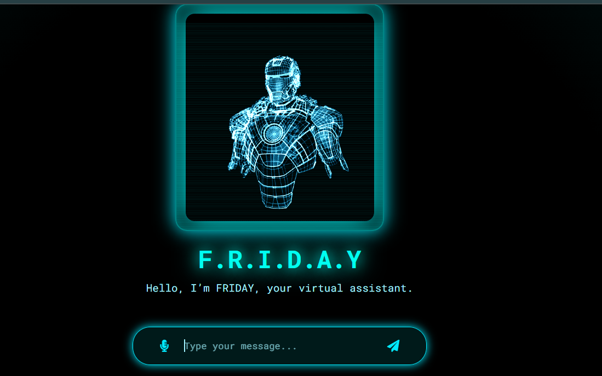
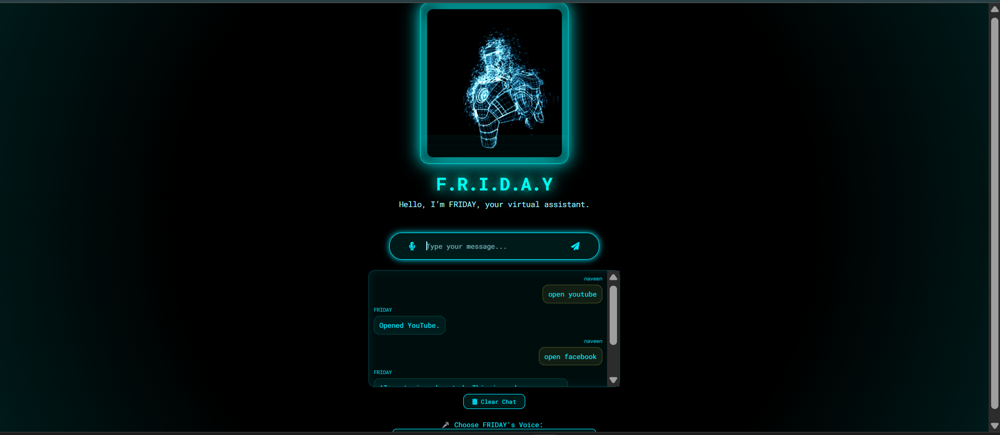

# 🎙️ FRIDAY – AI Voice Assistant


---

**A full-stack AI voice assistant enabling real-time interaction using speech and text.**

---

## 🌐 Live Demo

https://bethinaveen23.github.io/FRIDAY-AI-Voice-Assistant/

---

## 📸 Preview





---

## 📌 Overview

FRIDAY is a web-based AI assistant that allows users to interact using voice commands or text input.

The system integrates browser-based speech recognition with backend AI processing to provide real-time conversational responses.

---

## ⚙️ Key Features

* 🎤 Voice input using speech recognition
* 🔊 Text-to-speech responses
* 💬 Real-time chat interface
* 🧠 AI-powered responses via API integration
* 🔄 Continuous conversation flow
* 🌐 Deployed and accessible via browser

---

## 🔄 How It Works

```
User speaks / types
        ↓
Speech → Text (if voice input)
        ↓
Frontend sends request
        ↓
Backend processes input
        ↓
AI API generates response
        ↓
Response shown + spoken aloud
```

---

## 🧪 Tech Stack

* **Frontend:** HTML, CSS, JavaScript
* **Backend:** Node.js, Express.js
* **APIs:** AI API (for response generation)
* **Browser APIs:** Web Speech API

---

## 💡 What This Project Demonstrates

* Real-time voice interaction using browser APIs
* Integration of AI APIs into a working application
* Full-stack flow from user input to response
* Building usable AI systems, not just models

---

## ⚠️ Limitations

* Depends on external AI APIs
* No long-term conversation memory
* Limited contextual understanding

---

## 📂 Project Structure

```plaintext
FRIDAY-AI-Voice-Assistant/
│
├── assets/
│   ├── chat.png
│   └── ui.png
│
├── app.js
├── server.js
├── index.html
├── style.css
├── giphy.gif
├── package.json
└── README.md
```

---

## 🚀 Future Improvements

* Add conversation memory
* Improve NLP understanding
* Enhance UI/UX design
* Add authentication & user profiles

---

## 👤 Author

**Bethi Naveen Kumar**
🔗 https://www.linkedin.com/in/naveen-kumar-23109i

---

## ⭐ Final Note

This project focuses on building a real-time AI application that combines voice interaction, backend processing, and API integration into a usable system.
